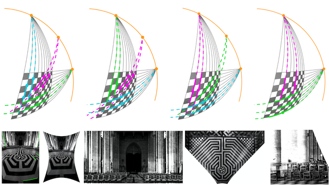
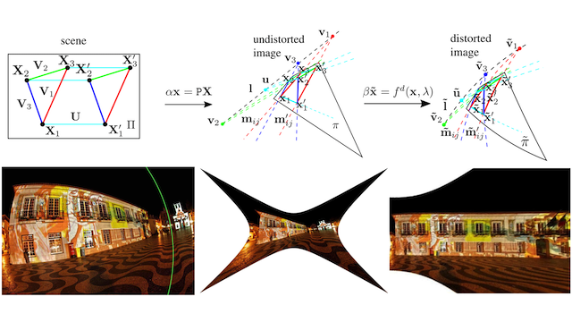
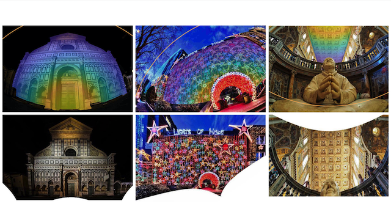

[Google Scholar](https://scholar.google.com/citations?user=9tfA7cMAAAAJ) · [GitHub](https://github.com/ylochman) · [LinkedIn](https://www.linkedin.com/in/yaroslava-lochman-008408129/)

From Feb to Aug 2020 I was a research intern at [Facebook Reality Labs][frl] in Pittsburgh under supervision of [James Pritts](https://prittjam.github.io) and [Michal Perdoch](https://scholar.google.com/citations?user=0Y_LBNIAAAAJ).

I received my MSc in Jan 2020 at [Ukrainian Catholic University (UCU)][ucu]. During my master's studies, I conducted research in the [Machine Learning Lab][mllab]. There I was advised by [James Pritts](https://prittjam.github.io).

My research focuses on robust methods for auto-calibrating cameras with severe lens aberrations. Prior, I developed deep learning models for semantic segmentation, boundary object detection, and studied geometry-aware deep representations for dense feature matching and symmetry detection. Currently, I am very interested in combining geometry and machine learning for 3D vision.

<!-- ---

#### News

**Feb 2020:** | Started a Research Internship at [Facebook Reality Labs][frl] in Pittsburgh.
**Jan 2020:** | Presented my [Master's Thesis](http://er.ucu.edu.ua/bitstream/handle/1/2039/Lochman_Minimal%20Solvers%20for%20Single.pdf) at [Ukrainian Catholic University (UCU)][ucu].
**Dec 2019:** | Organised a [Computer Vision course](https://github.com/ucuapps/computer-vision-course) for CS bachelors at [UCU][ucu].
**Sep 2018:** | Obtained a scholarship for conducting research in the [Machine Learning Lab][mllab] at [UCU][ucu]. -->

[ucu]: https://apps.ucu.edu.ua/en
[mllab]: https://apps.ucu.edu.ua/en/mllab
[frl]: https://tech.fb.com/codec-avatars-facebook-reality-labs

---

### Publications

 || **Minimal Solvers for Single-View Auto-Calibration**   **Y. Lochman**, [O. Dobosevych][odobosevych], [R. Hryniv][rhryniv], [J. Pritts][jbpritts]   In [WACV](http://wacv2021.thecvf.com) 2021 · Oral · release soon
||
 || **Minimal Solvers for Rectifying from Radially-Distorted Conjugate Translations**   [J. Pritts][jbpritts], [Z. Kukelova][zkukelova], [V. Larsson][vlarsson], **Y. Lochman**, [O. Chum][ochum]   In [TPAMI][tpami20] 2020 · [arxiv][tpami20-arxiv] · [code][repeats] · [bibtex](pages/bibtex/pami20.html)
||
 || **Minimal Solvers for Rectifying from Radially-Distorted Conjugate Translations** [J. Pritts][jbpritts], [Z. Kukelova][zkukelova], [V. Larsson][vlarsson], **Y. Lochman**, [O. Chum][ochum]   In [IJCV][ijcv20] 2020 · [arxiv][ijcv20-arxiv] · [code][repeats] · [bibtex](pages/bibtex/ijcv20.html)

[jbpritts]: https://scholar.google.com/citations?user=fvTKAEUAAAAJ
[zkukelova]: https://scholar.google.com/citations?user=M4a3VyYAAAAJ
[vlarsson]: https://scholar.google.com/citations?user=vHeD0TYAAAAJ
[ochum]: https://scholar.google.com/citations?user=4T42Ke0AAAAJ
[odobosevych]: https://scholar.google.com/citations?user=Zg-YKKQAAAAJ
[rhryniv]: https://scholar.google.com/citations?user=VqhpE1QAAAAJ

[repeats]: https://github.com/prittjam/repeats
[autocalib]: https://github.com/ylochman/autocalib

[tpami20]: https://ieeexplore.ieee.org/document/9086062
[tpami20-arxiv]: https://arxiv.org/pdf/1911.01507.pdf

[ijcv20]: https://link.springer.com/article/10.1007/s11263-019-01216-x
[ijcv20-arxiv]: https://arxiv.org/pdf/1907.11539.pdf