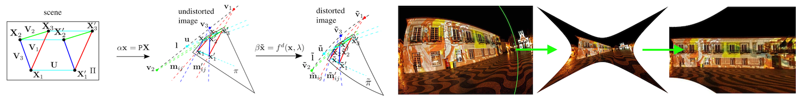
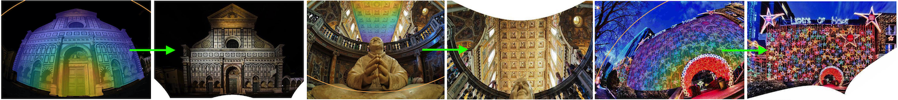

# About

(Since 12/2020) I am a PhD student in the <a href="https://www.chalmers.se/en/departments/e2/research/Signal-processing-and-Biomedical-engineering/Pages/Image-and-video-analysis.aspx">Computer Vision and Medical Image Analysis group</a> at Chalmers University of Technology supervised by <a href="https://www.chalmers.se/en/staff/Pages/Christopher-Zach.aspx">Christopher Zach</a> and co-supervised by <a href="http://www.maths.lth.se/matematiklth/personal/calle/">Carl Olsson</a>.
 

(02/2020 -- 08/2020) I was a research intern at <a href="https://tech.fb.com/codec-avatars-facebook-reality-labs">Facebook Reality Labs</a> in Pittsburgh working on robust methods for auto-calibrating cameras with severe lens aberrations under supervision of <a href="https://prittjam.github.io">James Pritts</a> and <a href="https://scholar.google.com/citations?user=0Y_LBNIAAAAJ">Michal Perdoch</a>.

(09/2018 -- 01/2020) I received my MSc at <a href="https://apps.ucu.edu.ua/en">Ukrainian Catholic University (UCU)</a> where I also conducted research in the <a href="https://apps.ucu.edu.ua/en/mllab">Machine Learning Lab</a>, advised by <a href="https://prittjam.github.io">James Pritts</a>. There I also studied geometry-aware deep representations for dense feature matching and symmetry detection.

My research interests cover geometry, machine learning, and especially their combination applied in 3D Vision.

 

# Publications

##### [**Minimal Solvers for Single-View Lens-Distorted Camera Auto-Calibration**](pub/wacv21.html#title)  
**Y. Lochman**, [O. Dobosevych][odobosevych], [R. Hryniv][rhryniv], [J. Pritts][jbpritts]  
In [WACV](http://wacv2021.thecvf.com) 2021 · Oral · [arxiv][wacv21-arxiv] · [code][autocalib] · [bibtex](pub/wacv21.html#citing)

##### [Minimal Solvers for Rectifying from Radially-Distorted Conjugate Translations](pub/pami20.html#title)   
[J. Pritts][jbpritts], [Z. Kukelova][zkukelova], [V. Larsson][vlarsson], **Y. Lochman**, [O. Chum][ochum]  
In [TPAMI][tpami20] 2020 · [arxiv][tpami20-arxiv] · [code][repeats] · [bibtex](pub/pami20.html#citing)

##### [Minimal Solvers for Rectifying from Radially-Distorted Scales and Change of Scales](pub/ijcv20.html#title)   
[J. Pritts][jbpritts], [Z. Kukelova][zkukelova], [V. Larsson][vlarsson], **Y. Lochman**, [O. Chum][ochum]  
In [IJCV][ijcv20] 2020 · [arxiv][ijcv20-arxiv] · [code][repeats] · [bibtex](pub/ijcv20.html#citing)

[tpami20]: https://ieeexplore.ieee.org/document/9086062
[tpami20-arxiv]: https://arxiv.org/abs/1911.01507
[repeats]: https://github.com/prittjam/repeats

[ijcv20]: https://link.springer.com/article/10.1007/s11263-019-01216-x
[ijcv20-arxiv]: https://arxiv.org/abs/1907.11539
[repeats]: https://github.com/prittjam/repeats

[wacv21-arxiv]: https://arxiv.org/abs/2011.08988
[autocalib]: https://github.com/ucuapps/single-view-autocalib

[jbpritts]: https://scholar.google.com/citations?user=fvTKAEUAAAAJ
[zkukelova]: https://scholar.google.com/citations?user=M4a3VyYAAAAJ
[vlarsson]: https://scholar.google.com/citations?user=vHeD0TYAAAAJ
[ochum]: https://scholar.google.com/citations?user=4T42Ke0AAAAJ
[odobosevych]: https://scholar.google.com/citations?user=Zg-YKKQAAAAJ
[rhryniv]: https://scholar.google.com/citations?user=VqhpE1QAAAAJ