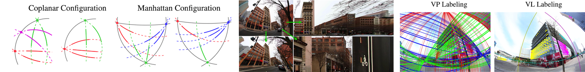

[Yaroslava Lochman][ylochman], [Oles Dobosevych][odobosevych], [Rostyslav Hryniv][rhryniv], [James Pritts][jbpritts] 

*Winter Conference on Applications of Computer Vision, Oral (2021)*

[PDF][wacv21-arxiv-pdf] · [arxiv][wacv21-arxiv] · [code][autocalib]

### Abstract
This paper proposes minimal solvers that use combinations of imaged translational symmetries and parallel scene lines to jointly estimate lens undistortion with either affine rectification or focal length and absolute orientation. We use constraints provided by orthogonal scene planes to recover the focal length. We show that solvers using feature combinations can recover more accurate calibrations than solvers using only one feature type on scenes that have a balance of lines and texture. We also show that the proposed solvers are complementary and can be used together in a RANSAC-based estimator to improve auto-calibration accuracy. State-of-the-art performance is demonstrated on a standard dataset of lens-distorted urban images.



### Citing
```bibtex
@InProceedings{Lochman-WACV21,
    title     = {Minimal Solvers for Single-View Lens-Distorted Camera Auto-Calibration},
    author    = {Lochman, Yaroslava and Dobosevych, Oles and Hryniv, Rostyslav and Pritts, James},
    booktitle = {Proceedings of the IEEE Winter Conference on Applications of Computer Vision},
    year      = {2021},
}
```

[wacv21-arxiv]: https://arxiv.org/abs/2011.08988
[wacv21-arxiv-pdf]: https://arxiv.org/pdf/2011.08988.pdf
[autocalib]: https://github.com/ucuapps/single-view-autocalib

[ylochman]: https://scholar.google.com/citations?user=9tfA7cMAAAAJ
[jbpritts]: https://scholar.google.com/citations?user=fvTKAEUAAAAJ
[odobosevych]: https://scholar.google.com/citations?user=Zg-YKKQAAAAJ
[rhryniv]: https://scholar.google.com/citations?user=VqhpE1QAAAAJ